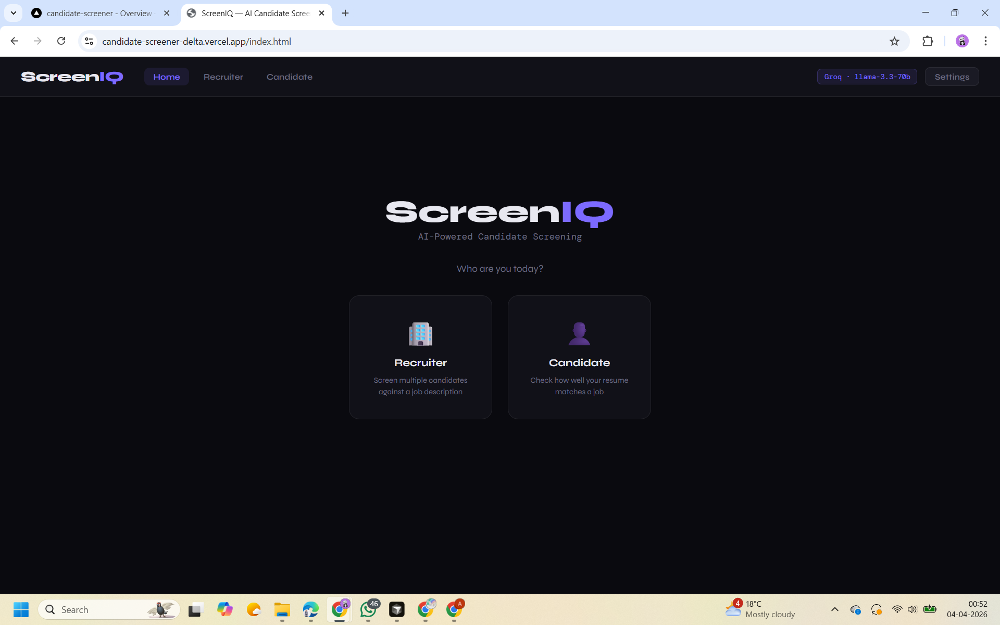
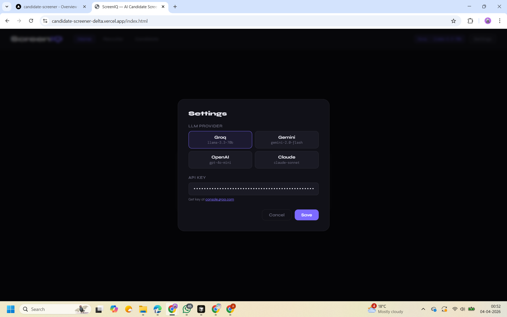
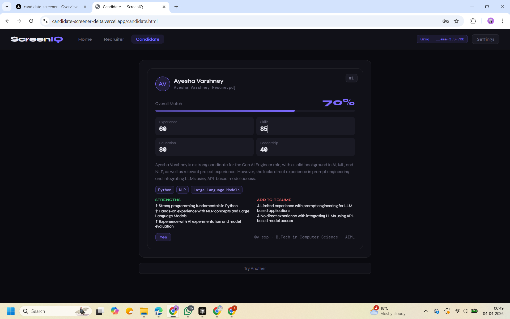

# ScreenIQ

ScreenIQ is a next-generation, privacy-first AI candidate screening tool. Instantly analyze resumes and job descriptions using leading-edge LLMs (Groq, OpenAI, Gemini, Anthropic) — all without sensitive candidate data ever leaving the browser or your control.


## Overview
Live Demo: https://candidate-screener-delta.vercel.app


ScreenIQ empowers recruiters and candidates alike to securely and fairly evaluate resume-job fit using state-of-the-art AI models. Our robust backend and intuitive frontend make unbiased, transparent, and customizable screening possible in seconds.

**Key Features:**
- **Multi-Provider LLM Support:** Use Groq, OpenAI, Google Gemini, or Anthropic Claude — bring your own API key.
- **Strict & Transparent Scoring:** Experience, Skills, Education, and Leadership are scored harshly and independently.
- **Bias Detection:** Built-in audit flags potential gender, ethnicity, or prestige bias in LLM evaluations.
- **Privacy-First:** All API keys are stored on-device (never on our servers). Your data & credentials stay yours.
- **No Resume Inflation:** Our logic enforces no “fluffy” matches and discourages AI hallucinations.
- **Zero Trust:** LLM-calculated scores are double-checked/validated server-side for accuracy.


## Tech Stack

- **Backend:** FastAPI (Python), served over Vercel or your own infrastructure.
- **Frontend:** Vanilla JS, modern UI.
- **AI Providers:** Groq (Llama-3), OpenAI (GPT-4o-mini), Anthropic (Claude Sonnet), Google Gemini (2.0 Flash).
- **PDF Resume Parsing:** PyPDF2.
- **API Key Management:** 100% client-side (sessionStorage).
- **Other:** pydantic, python-dotenv, CORS, dotenv, python-multipart.


## Setup Instructions

### 1. **Clone & Install Backend**

```bash
git clone https://github.com/YOUR_ORG/screeniq.git
cd screeniq/candidate screener/backend
python -m venv venv
source venv/bin/activate
pip install -r requirements.txt
```
Set up your environment variables (`.env`), if any are needed.

### 2. **Run the FastAPI Server**

```bash
uvicorn main:app --reload
```

_Note: You can serve this on Vercel or another platform — see deployment documentation as needed._

### 3. **Frontend**

No build step! Static files are in `candidate screener/frontend/`. Open `index.html` (or `recruiter.html` / `candidate.html`) in your browser.

> **Tip:** To use a provider, generate your own API key (we never store it — keys are saved only in your browser’s sessionStorage).


## Usage

1. **Upload Resumes & Job Description**
   - For recruiters: Drag & drop multiple resumes, paste the JD.
   - For candidates: Upload your resume and the JD.

2. **Choose LLM Provider & Enter API Key**
   - Settings > Select provider (Groq, Gemini, OpenAI, Anthropic)
   - Paste your API key (see provider-specific instructions).

3. **Review Results**
   - Get structured breakdowns: scores, summary, strengths, gaps, recommendations, bias audit.


### App Preview

**1. Modern Dashboard**


**2. Multi-LLM Provider Settings**


**3. Detailed AI Analysis & Scoring**



## Privacy-First Philosophy

- **API keys**: stored only in the browser _(sessionStorage)_. Never sent to us, ever.
- **PDF/Resume parsing**: happens on your device or through ephemeral serverless endpoints (auto deletion).
- **Scoring logic**: every candidate’s scores are double-checked, and bias audits are exposed by default.


## Extensibility

- **Add your own provider**: See `backend/main.py` for LLM integration logic.
- **Customize scoring**: Adjust `WeightConfig` via the frontend or tweak logic server-side.
- **Integrate with ATS/HRIS**: Simple RESTful endpoints (see `/api/screen`, `/api/rerank`, `/api/parse-pdf`).


## Contributions

PRs, issue submissions, and feature ideas welcome! Our system is built for transparency — if you spot bias or want new features, open an issue.


## License

[MIT License](./LICENSE)


